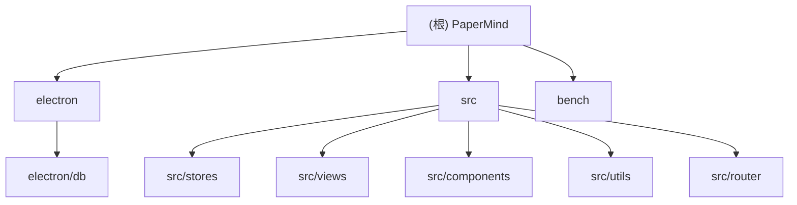

# PaperMind

**变更记录**
- 2026-09-24: 去掉回答输出上限——`LLMProfile.maxTokens` 语义改为「0 = 不限制」：OpenAI 兼容端点与 Ollama 不再发送 `max_tokens` / `num_predict`（`num_predict` 从「从不发送」改为「显式设了上限才发送」；`o` 系 / `gpt-5` 系设了上限时改发 `max_completion_tokens`），Anthropic Messages API 的 `max_tokens` 是必填字段，不限制时退到兜底常量 `CAPPED_MAX_TOKENS_DEFAULT`（8192），被老模型（claude-3-opus / haiku，上限 4096）拒绝时自动降级重试一次并记住该模型的上限；设置页与参数面板加「不限制」开关（滑块量程 `MAX_TOKENS_LIMIT`，关掉开关还原本地上次设过的值），旧落库配置里的出厂值 4096 在 `init()` 一次性迁移为不限制（标记 `llm_max_tokens_unlimited_migrated`，用户之后显式设回 4096 不会被再抹掉）。bench 侧 4096 是冻结的评测契约（`CONTEXT_BUDGET_TOKENS` + `generationContext.maxTokens`），未改
- 2026-09-15: 轻量语义树索引实验（分支 `exp/tree`）——新增原文证据块（`src/utils/evidenceBlock.ts`）、单次 LLM 调用建树（`src/utils/semanticTree.ts`）、单轮树路由与原文取证（`src/utils/semanticRoute.ts`，树节点与平面叶节点在同一次打分判断里评分，取证不足即就地回落平面，统一 24000 字符上下文预算）；`paper_trees` 表（含 `build_config_hash` 建树配置指纹）+ `tree` IPC 命名空间持久化；`useChatStore` 后台建树（默认开启，设置页可关，并提供「重建全部语义树」）；bench 新增 `semantic-tree` 配置、树诊断指标与 `npm run bench:trees` 人工结构检查
- 2026-09-09: 移除 `pageindex-adapted` 基线——上游 PageIndex 适配（Python 桥）端到端吞吐过低（推理模型逐题 agentic 检索），决策放弃：删 `bench/adapters/pageindex/`、`runner/pageindexQa.ts`、配置校验与 `upstreamCommit` meta 透传；强基线组保留 `hybrid-rerank` / `long-section-rag`（均已完成 qasper 179 篇全量）
- 2026-09-08: 强基线矩阵（bench）——新增 `hybrid-rerank`（BM25+BGE-M3→RRF→交叉编码器重排）与 `long-section-rag`（章节内连续阅读）两条可评测基线：`bench/src/baselines/` 原语、共享引擎 `strongBaselineQa.ts`、冻结 4096 上下文预算的严格配置校验、configs/README/CLAUDE.md 同步
- 2026-09-04: 新增 `bench/` 评测套件（QA 检索/答案 + 摘要 benchmark，配置矩阵消融，Node CLI）；RAG 管线抽出为 `src/utils/ragPipeline.ts` 纯函数以供评测复用
- 2026-08-02T15:49:42: 增量文档刷新——补记多 LLM 配置（profiles，对话/索引可分开）、PageIndex 持久化（`paper_indexes` 表 + `index` IPC 命名空间）、`/abstract` 摘要（Hugging Face T5 模型）、Markdown + KaTeX 渲染管线；新增 `electron/db/` 与 `src/router/` 模块文档，修正面包屑与 Mermaid 链接
- 2026-07-19T14:49:32: 前端 UI 美化（青绿主色、侧栏/知识库卡片/对话面板视觉升级）
- 2026-07-18T00:00:00: 检索管线升级（语义分块 + 查询改写 + 评分多选）
- 2026-06-07T21:33:55: 初始化 AI 上下文文档

---

## 项目愿景

本地运行的学术论文阅读助手桌面应用。所有数据存储在本地（SQLite + 磁盘 PDF），无后端服务，支持多 LLM provider（OpenAI / Anthropic / Ollama）进行论文问答与 RAG 检索。可创建多个命名 LLM 配置，分别用于「对话」与「论文索引」；对话中输入 `/abstract` 可调用 Hugging Face 摘要模型为所选论文生成摘要。

## 架构概览

```
Renderer Process (Vue 3)          Main Process (Node/Electron)
┌──────────────────────────┐      ┌─────────────────────────────┐
│  Vue Router (hash mode)  │      │  electron/main.ts           │
│  Pinia Stores            │      │  electron/ipc.ts            │
│  Element Plus UI         │◄────►│  electron/db/index.ts       │
│  pdfjs-dist (PDF 渲染)   │ IPC  │  electron/db/schema.ts      │
│  markdown-it + KaTeX     │      │  better-sqlite3（8 张表）    │
│  直接 fetch → LLM API    │      │  磁盘：papermind.db + papers/│
│  直接 fetch → HF 摘要 API │      └─────────────────────────────┘
└──────────────────────────┘
```

- `contextBridge` 将 `window.db` 注入渲染层，所有数据库操作通过 IPC 通道调用主进程（同步 better-sqlite3）。
- LLM 请求与 Hugging Face 摘要请求由渲染层直接发出（fetch），**不经过主进程**；凭据存于 `settings` 表。
- 论文导入后在后台构建 PageIndex 语义索引，序列化后存入 `paper_indexes` 表；对话检索时读取索引做评分多选（RAG）。
- 索引完成后另起**后台任务**构建轻量语义树（整篇一次 LLM 调用），树与原文证据块存入 `paper_trees` 表。树只承担导航职责，最终回答仍回到原文证据块与原始页码；建树失败、开关关闭或树取证不足时完全回落平面检索。建树缓存同时看原文指纹与构建配置指纹（提示词 / 模型端点 / 分块参数），任一变化都会让旧树失效。

## 模块结构



## 模块索引

| 模块 | 路径 | 职责 |
|------|------|------|
| 主进程 | `electron/` | Electron 入口、生命周期、外链拦截、IPC 注册 |
| 数据层 | `electron/db/` | SQLite 建表（8 表）+ 全部 CRUD / 索引 / 导出 API |
| 应用入口 | `src/` | Vue 引导、App 布局、全局样式、路由/测试/类型汇总 |
| 状态管理 | `src/stores/` | Pinia stores（论文/知识库、对话/多 LLM 配置/索引/摘要） |
| 页面视图 | `src/views/` | 知识库、阅读器、对话、设置四个路由页面 |
| 公共组件 | `src/components/` | PdfViewer、ChatPanel、ParamPanel |
| 工具函数 | `src/utils/` | PDF 解析、PageIndex 检索、轻量语义树（证据块/建树/树路由）、Markdown 渲染、摘要分块 |
| 路由 | `src/router/` | Vue Router hash 模式路由配置 |
| 评测 | `bench/` | QA / 摘要 benchmark，配置矩阵消融，Node CLI |

## 运行与开发

```bash
# 安装依赖（会自动 rebuild better-sqlite3）
npm install

# 开发模式（Vite dev server + Electron）
npm run dev

# 类型检查
npm run typecheck

# 生产构建 + 打包
npm run build

# 手动重建 native 模块
npm run rebuild

# 评测（需先配置 BENCH_* 环境变量，见 bench/README.md）
npm run bench -- --task qa --dataset smoke --limit 5

# 语义树结构人工检查（只建树、不跑问答，输出 Markdown 供逐层核对）
npm run bench:trees -- --config semantic-tree --dataset qasper --limit 5 --out bench/results/trees.md
```

构建产物：`dist/`（渲染层）、`dist-electron/`（主进程）、`release/`（安装包）。

## 测试策略

使用 **Vitest**（与 Vite 同生态，配置在 `vite.config.ts` 的 `test` 段，环境 `jsdom`，`electron/**` 已排除）。

```bash
npm test            # 单次运行
npm run test:watch  # watch 模式
npm run test:ui     # 浏览器 UI
```

| 文件 | 覆盖内容 |
|------|---------|
| `src/tests/paper.store.test.ts` | usePaperStore：init、幂等、CRUD、`fileData` 剥离、按 KB 过滤（7 用例） |
| `src/tests/chat.store.test.ts` | useChatStore：init 加载/恢复 profiles、对话 CRUD、updateProfile 持久化（含反 Proxy 校验）、sendMessage RAG 调用次数（1/3 次）、`/abstract` 摘要与前置校验（12 用例） |
| `src/tests/pageIndex.test.ts` | scoreAndSelect：Top-2 / 阈值 / JSON 降级 / 单节点短路；buildPageIndex：预边界页面覆盖（6 用例） |
| `src/tests/pdfUtils.test.ts` | base64ToUrl：URL / Blob type；detectSectionBoundaries：英/中/大写标题、降级；mergeSmallSections：边界合并（11 用例） |
| `src/tests/abstractSummarizer.test.ts` | splitAbstractText 不丢内容、summarizeAcademicText 递归归约（2 用例） |
| `src/tests/markdown.test.ts` | renderMarkdown：结构渲染、外链 target/rel、XSS 净化、危险协议拦截、`$` / `\(\)` / `\[\]` LaTeX 归一（7 用例） |

**Mock 策略**：`src/tests/setup.ts` 在全局 `window.db` 上注入含 `kb / paper / chat / highlight / settings / index / data` 全部命名空间的 `vi.fn()` mock，stores 完全与 Electron IPC 解耦；涉及 `pageIndex.ts` 的测试需 `vi.mock('pdfjs-dist/legacy/build/pdf.mjs')`（Node 无 DOMMatrix）。

**待补充**：`parsePdfMeta` fixture 测试（需真实 PDF 文件）、Vue 组件渲染测试（PdfViewer 高亮层、ChatPanel Markdown 渲染）、`callAbstractModel` 网络错误分支。

## 编码规范

- TypeScript strict 模式（见 `tsconfig.json`，`moduleResolution: bundler`，路径别名 `@/*` → `src/*`）
- Vue 3 Composition API + `<script setup>`
- Pinia store 使用 setup 函数风格
- 主进程 API 均为同步 better-sqlite3 调用，IPC handler 通过 `ipcMain.handle` 注册
- JSON 字段（authors、tags、paper_ids、sources）在 SQLite 中以 TEXT 存储，读取时反序列化
- 渲染层通过 `window.db.*` 调用，类型声明在 `src/types/db.d.ts`
- 跨 IPC 传递前需将 Vue 响应式代理转为普通对象（结构化克隆无法序列化 Proxy，见 `chat.ts` 的 `persistProfiles`）
- CSS 变量统一在 `src/styles/global.css` 中定义，组件内使用 `scoped` 样式

## AI 使用指南

- **修改数据模型**时，需同步更新：`electron/db/schema.ts`、`electron/db/index.ts`（序列化/反序列化）、`src/stores/paper.ts` 或 `src/stores/chat.ts` 中的接口定义、`src/types/db.d.ts`
- **新增 IPC 通道**：在 `electron/ipc.ts` 注册 handler，在 `electron/preload.ts` 暴露方法，在 `src/types/db.d.ts` 补充类型（4 处保持一致）
- **LLM 配置为多 profile**：`chat.ts` 维护 `profiles[]` + `chatProfileId` / `indexProfileId`；对话用 `chatProfile`，索引用 `indexProfile`；持久化键 `llm_profiles`、`llm_profile_chat`、`llm_profile_index`（旧单一 `llm_config` 会在 init 时迁移）。`maxTokens` 用 `0` 表示**不限制**（`UNLIMITED_MAX_TOKENS`）：OpenAI 兼容端点与 Ollama 不发送上限参数，Anthropic 因 API 必填退到 `CAPPED_MAX_TOKENS_DEFAULT`（老模型拒绝时自动降级到 `ANTHROPIC_LEGACY_MAX_TOKENS` 并记住）；采样与上限按模型代次由 `generationParams` 决定（`o` 系 / `gpt-5` 系改发 `max_completion_tokens` 且**不发 `temperature`**——非默认温度会被直接拒绝；其余含第三方兼容端点发 `max_tokens` + `temperature`）；截断提示仍由 `finish_reason` 驱动，与是否设上限无关
- **对话主流程**在 `chat.ts` 的 `sendMessage`：先判 `/abstract` 命令（走 `generateAbstract` → Hugging Face），否则走 RAG 3-call（查询改写 `rewriteQuery`（有历史时）→ 评分多选 `scoreAndSelect` → 生成回答 `callLLM`）
- **检索/索引逻辑**在 `src/utils/pageIndex.ts`：`buildPageIndex` 构建语义分块索引，`scoreAndSelect` 做评分多选（旧 `retrieve` 已删除）；索引经 `window.db.index.set` 持久化到 `paper_indexes` 表
- **轻量语义树**（分支 `exp/tree`）在 `src/utils/evidenceBlock.ts` / `semanticTree.ts` / `semanticRoute.ts`：每篇论文**恰好一次** LLM 调用建树（≤16 节点、根外两层），提问时单轮路由回原文证据块取证——查询阶段串行调用数与平面 `scoreAndSelect` 相同（树节点与平面叶节点在同一次判断里打分，取证不足即就地用这批平面打分回落）；树存 `paper_trees`（经 `window.db.tree.*`），缓存键 = 原文指纹 + 构建配置指纹。开关 `treeEnabled` 默认开启，建树失败或关闭时完全回落平面路径
- **摘要逻辑**在 `src/utils/abstractSummarizer.ts`：`splitAbstractText` 分块 + `summarizeAcademicText` 递归归约调用 T5 模型；需 `huggingface_token` 设置项
- **消息渲染**用 `src/utils/markdown.ts` 的 `renderMarkdown`（markdown-it + texmath/KaTeX + DOMPurify 净化）；模型输出的 `\(...\)` / `\[...\]` 会被归一为 `$` 语法
- PDF.js 使用兼容 Electron 31 的 legacy 构建；worker 使用相对路径 `./pdf.worker.min.mjs`（`public/` 目录），由 `vite.config.ts` 启动时从 `node_modules/pdfjs-dist/legacy/build/` 复制，兼容开发服务器与打包后的 `file://`，且离线可用

## 最终检查
在交付代码修改的结果之前，请自行进行类型检查，你必须运行的命令是 `npm test` 和 `npm run typecheck`，只有全部通过后才能交付。（纯文档 / `.claude` 变更不影响类型与测试状态。）
