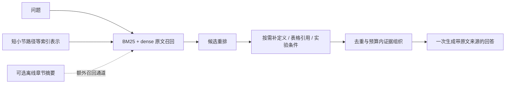

# 面向 PaperMind 的语义检索与证据组织调研

调研日期：2026-10-02。范围：2023—2026 年公开工作，补充 2019—2022 年基础方法；纳入 22 项工作（21 篇论文、1 篇官方工程报告）。用途：为本地科学 PDF 问答选择可验证、延迟可控的方法，不是跨榜单 SOTA 排名。论文索引、核验深度与限制见[论文矩阵](2026-10-02-semantic-paper-retrieval-papers.md)。本次未运行复现、修改 benchmark 或调用付费模型。

## 1. 最值得采纳的判断

1. 当前应优先建立 **混合召回 + 小规模重排 + 原文证据组织** 的强基线。结构可以辅助定位和补全，不必成为所有问题必经的 LLM 路由。
2. “更语义化”至少包含四件不同的事：段落脱离上下文后仍可理解；问题与候选证据精细匹配；找到跨段依赖；组成足以回答问题的证据集。换更大的 embedding 或加一棵树不能同时解决它们。
3. **单篇内找证据与跨论文找文献不同。** 文档主题信息可能帮助区分论文，却削弱同一篇中各段的区分度。这是本次调研后对先前“先上上下文化 embedding”建议的重要修正。
4. RAPTOR 值得读：它确实在 QASPER 上评测过，且主实验使用 collapsed-tree 检索，不要求在线逐层走树。但它的正文摘要树与我们的目录树不同；同 retriever 的控制实验增益也远小于一些跨配置比较给人的印象。
5. OpenScholar、PaperQA2 是科学文献系统的重要参照。优先借鉴证据筛选、来源追踪和覆盖检查；它们的跨文献工具循环不宜整体搬进交互式单篇问答。
6. 是否加关系结构，应由失败案例决定：只有确实反复缺少定义、表格说明、实验条件或跨段关联时，结构扩展才有明确目标。

以上是面向本项目的工程判断，而不是这些论文共同证明的统一结论。

## 2. 范围、检索路径与证据分级

目标场景：本地导入科学论文 PDF，生成模型通过 API 使用检索上下文；主要评测为已知论文内的 QASPER 问答；关心 AnswerF1、官方 EvidenceF1、retrieval latency 与 TTFT 的 P50/P95。

检索路径包括：contextual retrieval / late chunking / contextual document embeddings；QASPER + hierarchical retrieval；scientific literature QA + evidence reranking；HippoRAG / GraphRAG；semantic chunking negative results；2026 chunking reproduction。以 ACL Anthology、ICLR/OpenReview、arXiv、Nature、作者仓库为来源；从 RAPTOR、Late Chunking、HippoRAG 2 的相关工作追踪后续比较与反例。

纳入：能够解释本场景某一失败机制，或构成必要 baseline / 反证的工作。排除：仅营销描述、未经核验的二手实现、把实体图和目录树混称的教程，以及没有直接迁移价值的通用 agent 排名。LightRAG、CRAG 等保留为后续候选，本轮不扩展同类方法数量；它们未被判定无效。

证据标签指本次核验程度：**中**表示检查了方法/实验相关正文，但没有独立复现；**弱/摘要**表示只足以确认方法方向，不据此引用精确优势。工程报告单列。没有将任何路线认定为本项目已验证有效。

## 3. 问题地图与方法地图

| 失败位置 | 具体表现 | 可借鉴方法 | 对 PaperMind 的边界 |
|---|---|---|---|
| PDF → 原文块 | 表格、公式、阅读顺序损坏 | ColPali；文本与页面视觉双通道 | 文本已丢失的信息，文本 reranker 无法恢复 |
| 原文块 → 可搜索表示 | “该方法”“这个设置”缺少所指 | Contextual Retrieval、Late Chunking、ConTEB/InSeNT | 上下文太多会冲淡段落特征 |
| 候选召回 | 专名能匹配、同义表达漏召回 | BM25 + dense；BGE-M3 类多模式表示 | 现有 B 已有混合召回，应先做充分对照 |
| 候选排序 | 主题相关，但不回答这个问题 | cross-encoder；ColBERT token 级交互 | 重排不能找回未进入候选的证据 |
| 证据依赖 | 有结果，没有实验条件；有结论，没有比较对象 | HippoRAG 2 的关系检索；轻量显式引用扩展 | 完整抽取图及在线 LLM 过滤都有成本 |
| 全局理解 | 问整篇贡献、多个章节共同结论 | RAPTOR、GraphRAG 社区摘要 | 摘要不是原文，不能直接伪装成 gold evidence |
| 上下文组装 | 重复、缺另一侧证据、截断否定条件 | RECOMP、PaperQA2、Sufficient Context | 压缩也会破坏限定词与来源对齐 |
| 复杂问题检索不足 | 单次检索缺子问题，答案需再找资料 | OpenScholar、Self-RAG | 查询时多轮调用提高 TTFT；宜按需触发 |

时间脉络：2019—2022 年双编码召回、交叉编码重排与多向量交互奠定基础；2023—2024 年从固定段落扩展到命题、摘要树、反思式检索；2025 年开始强调上下文表示训练、关系记忆和证据充分性；2026 年的系统论文与复现更突出任务协议差异。这个脉络不代表旧方法被新方法全面替代。

## 4. 优先阅读的工作及可借鉴部分

### 4.1 Contextual Retrieval：补足段落缺失的语境

Anthropic 的做法是在索引时为 chunk 生成特定语境说明，再用于 dense 与 BM25。它是官方工程报告，不是统一开放 benchmark 的学术结论。报告中的相对失败率降幅不能解释为 AnswerF1 同比例提升。[原文](https://www.anthropic.com/engineering/contextual-retrieval)

**建议借鉴**：先试无需生成模型的短 section path、小节标题、明确术语定义；只改变搜索表示，返回给回答模型及 EvidenceF1 的仍为可定位原文。元数据版是我们的简化实验，不是对原方法的完整复现。

**项目特有风险**：当前已知论文内检索，给每个段落重复论文标题或整篇摘要可能主要添加共同噪声；优先比较“段落原文”与“短小节路径 + 原文”，保留原文通道。不能认为 metadata 越多越好。

### 4.2 Late Chunking 与 ConTEB：让段落向量带上上下文，但保持区分度

Late Chunking 先对长文本生成 token 表示，再按段落范围池化。在线仍可使用向量检索，新增成本主要在索引阶段；需要支持长上下文和 token 输出的合适模型，不是切块函数的简单替换。[Late Chunking](https://arxiv.org/html/2409.04701v2)

ConTEB/InSeNT 进一步研究“模型是否真的使用了其他段落的信息”。同篇负例训练同时约束段落区分度；论文也报告了未经适配的上下文化在 CovidQA 上引入噪声的现象。**同篇 hard negatives** 比“所有段落一律附带整篇摘要”更值得借鉴。[Context is Gold](https://arxiv.org/html/2505.24782v2)

2026 年 Beyond Chunk-Then-Embed 的复现显示：BEIR 文档库检索与 GutenQA 单文档检索的排序、上下文化收益不同。但 GutenQA 是书籍，不是科学论文，且该版本代码链接仍匿名。它提供了警示，没有证明 Late Chunking 在 QASPER 必然失败。[复现研究](https://arxiv.org/html/2602.16974v1)

**优先级**：先诊断同篇内混淆，再做受控消融；排在轻量 reranker 之后，不直接替换现有 embedding。

### 4.3 Cross-encoder / ColBERT：从“相似主题”走向“匹配问题条件”

Cross-encoder 联合读取 query 与 passage；ColBERT 保留多个 token 表示，在查询时做细粒度交互。二者不能混称，Late Interaction 也不是 Late Chunking。[BERT reranking](https://arxiv.org/abs/1901.04085)、[ColBERTv2](https://aclanthology.org/2022.naacl-main.272/)

**建议借鉴**：B 的候选池后接一个可本地运行的小型重排模型；候选数量、输入长度、冷启动与设备推理都要实测。先不指定一个“当前最强”模型，因为 Python/CUDA 论文速度不能外推到 Electron/ONNX/用户 Mac。

先看候选池是否包含关键证据：若没有，reranking 不是主要解法；若已有却没有进入最终上下文，它才是高价值改动。ColBERT 可作后续更强表示的对照，初期不必承担多向量索引复杂度。

### 4.4 RAPTOR：值得借鉴的树，是内容层次而非目录门禁

它用正文聚类与递归摘要构建多层索引，主实验直接检索展开后的各层节点。在原文 QASPER Table 2 中，同为 UnifiedQA-3B + SBERT，加入树为 36.23 → 36.70 AnswerF1；Table 3 的 GPT-4 + RAPTOR 为 55.7、DPR 为 53.0，但后者不是同 retriever 的纯结构消融。因此不能把所有差额都归因于“树”。[RAPTOR 原文](https://arxiv.org/html/2401.18059v1)

**建议借鉴**：若案例证明需要跨节综合，可离线为章节生成摘要，把摘要作为另一条召回通道；命中后回溯原段落并与普通召回合并。这是受启发的原文回溯变体，不等同于直接把摘要交给模型的原版。

我们的目录 D 结果不能否定 RAPTOR；RAPTOR 结果也不能证明目录 D 应当有效。

### 4.5 HippoRAG 2：关系结构辅助找原文

HippoRAG 2 将 passage 与抽取关系结合，通过 query–triple 匹配、在线 LLM 过滤和 Personalized PageRank 找相关段落。它还报告了部分结构方法在强 dense 基线面前退化的情况，说明增加结构本身不构成收益保证。[原文](https://arxiv.org/html/2502.14802v2)

**建议借鉴**：只先记录有依据的关系，如段落指向 Figure/Table、缩写指向定义、结论指向实验设置。初始命中后做有预算的一跳补全，保持最终证据为原文。

这不是完整 HippoRAG 复现，也不应称为新的通用知识图谱。它在 PaperMind 是否有效是待验证假设。现有邻段扩展已存在，新增价值必须来自明确依赖关系，而非再扩大邻居窗口。

### 4.6 PaperQA2 与 OpenScholar：检索之后还要处理证据

PaperQA2 的 Gather Evidence 在 dense 候选后进行 LLM relevance 判断与上下文化摘要，再生成带来源的回答。它说明检索、证据处理与写答案可以分开设计；同时，这一步需要在线调用。[PaperQA2](https://arxiv.org/html/2409.13740v1)

OpenScholar 的正式论文发表于 Nature 2026；它结合科学文献召回、重排、带引用生成、自反馈补检索及引用核查。其 ScholarQABench 多论文综合成绩不能与我们的 QASPER 分数横比。[OpenScholar](https://www.nature.com/articles/s41586-025-10072-4)

**建议借鉴**：每条原文 evidence 保留 source ID、对应子问题和限定条件；对于比较题分别覆盖比较对象。先用抽取式选择、去重和覆盖约束做证据组织，再判断是否值得引入在线摘要。不要默认每题进入多轮 agent 流程。

### 4.7 Sufficient Context：把错误归因做准确

这篇工作区分了“上下文是否足以作答”与“模型是否会利用它”。有相关段落不等于有完整答案；有完整证据也不保证正确生成。[原文](https://arxiv.org/html/2411.06037v2)

适合用于离线案例审查：召回缺失、排序淘汰、证据不全、证据已足但生成失败、评分与语义不一致。这里是调试分类建议，不增加用户已固定的正式 metrics，也不建议给每次请求加一个额外 LLM 判官。

## 5. 不宜优先照搬的路线

| 路线 | 适合的问题 | 暂不优先的原因 |
|---|---|---|
| GraphRAG 全局社区摘要 | 整个文献库的主题、趋势与综合 | 原始工作主要针对 corpus-level query-focused summarization；与已知单篇精确证据任务不一致 [论文](https://arxiv.org/abs/2404.16130) |
| 全量命题生成 | 细粒度事实检索 | Dense X 提供有价值方向，但离线抽取有成本，限定条件与原文映射可能丢失 [论文](https://aclanthology.org/2024.emnlp-main.845/) |
| 每题多轮反思 / query reasoning | 难推理、多跳、资料不全 | 有能力收益潜力，也直接增加在线开销；Self-RAG 原方法涉及专门训练，不是仅加提示词 [论文](https://arxiv.org/abs/2310.11511) |
| 默认视觉页面检索 | 图表、版式、扫描 PDF | ColPali 有明确价值，但增加视觉模型与多向量成本，且页面命中不等于段落 EvidenceF1 [论文](https://arxiv.org/abs/2407.01449) |
| 只换语义切块 | 边界确实破坏局部语义 | 切块名称不能保证提升；需要与等预算段落切块比较 [反例研究](https://arxiv.org/abs/2410.13070) |

## 6. 评测地图：哪些证据能迁移

| 任务 / 数据 | 常见指标 | 必要对照 | 对当前项目的用途 / 风险 |
|---|---|---|---|
| 当前 QASPER PDF 179 题 | AnswerF1、官方 EvidenceF1；两类延迟 P50/P95 | A/B/C、新 D、R 固定口径 | 核心开发集；已反复观察，不能再称未见测试集 |
| RAPTOR 的 QASPER | AnswerF1 | 同 reader、同 retriever ±结构 | 原始输入、模型、划分与本地 PDF 不同；55.7 不是我们的验收线 |
| BEIR / MTEB 检索 | nDCG、Recall 等 | BM25、dense、reranking | 跨文档排序强不代表单篇内精确证据强 |
| ConTEB | nDCG@10 | 普通表示、late chunking、适配训练 | 测段落对全文上下文依赖；部分受控构造，非 QASPER 替代 |
| GutenQA 切块复现 | DCG@10 | 同 embedder 不同切块/池化 | 书籍单文档反例；不能直接推断论文问答 |
| MuSiQue / HotpotQA 等 | 检索 Recall、QA F1/EM | 强 dense、多跳与图方案 | 检验跨证据关联；语料与问题形式有差异 |
| LitQA2 / ScholarQABench | 准确性、弃答、引用、覆盖等各自协议 | 科学搜索及综合系统 | 跨论文阶段参考；不与 AnswerF1 混排 |
| ViDoRe / DocBench | 页面检索 / 原始文档 QA 各自指标 | 文本、视觉、多模态 | 后续检查图表和真实 PDF 泛化 |

这些是文献中使用的指标，不是修改当前 benchmark 的建议。数据集细节另见 [既有评测调研](2026-10-01-paper-qa-evaluation-survey.md)。

## 7. Claim–Evidence 审计与失败案例

| 常见主张 | 实际证据 | 缺口与裁决 |
|---|---|---|
| 上下文 embedding 总会更好 | Late Chunking、ConTEB 有正结果；2026 复现有任务反转 | 部分支持；必须测同篇区分度，不可普遍化 |
| 树显著提升论文问答 | RAPTOR 有 QASPER 实验及结构消融 | 同配置增益可能较小；摘要树、目录树不是一回事 |
| 相关性更高，答案就会更好 | Sufficient Context 揭示证据充分性与生成利用差异 | 不支持简单等价；分别检查证据完整性和生成 |
| 科学 agent 优于普通 RAG，应整体采用 | PaperQA2、OpenScholar 在各自任务上有系统实验 | 同篇低延迟协议未验证；只借鉴匹配的组件 |
| 加图就形成有用 memory | HippoRAG 2 展示关系与 passage 联合方法，也揭示前代退化 | 外部索引确可跨请求复用，但结构质量与检索策略决定收益 |

建议审查的案例类型（假设，不是本次测得的频率）：

- 同一术语在方法、实验与讨论里反复出现，dense 命中主题而非问题要求的实验设置。
- 命中提升数值，却缺 baseline、数据集、显著性或限制条件。
- 比较题只召回一方；两段单看相关，合起来仍不能回答。
- 摘要删掉否定词、条件或对象，AnswerF1 偶然升高而事实变错。
- 表格原始解析缺列头；继续改文本检索无法补回缺失信息。
- 证据原文正确但 PDF 段落对齐失败，使 EvidenceF1 低估检索；需要与检索失败分开。

Lost in the Middle 提供上下文位置影响利用的经典证据，但不能据此断言当前 API 模型具有同等幅度的位置偏差。[论文](https://aclanthology.org/2024.tacl-1.9/)

## 8. Baseline 阶梯与最小实验

建议把阅读后的实现候选控制为三个，而不是堆叠所有组件。

| 顺序 | 最小改动与假设 | 独立对照 | 资源与证伪条件 |
|---|---|---|---|
| P0 | 审查 20—30 个代表性失败，区分召回、排序、缺依赖、生成、对齐 | 原有 B 的候选、最终 context、答案、gold 原段落 | 人工离线审查；若候选根本缺证据，降低 reranker 优先级 |
| P1 | B + 小型 cross-encoder；候选有证据但排位不好 | B；固定候选数/上下文预算 | 本地模型；计入加载与推理开销。质量无稳定提升或 P95 超预算则停 |
| P1 | 短 section path 增强，但保留原文表示 | B、增强版；不要同时换模型/切块 | 重建索引，无在线生成；若同篇误排增多则回退 |
| P2 | 对缺定义/表格引用的案例做一跳原文补全 + 去重 | 同底座 ±关系补全，邻段扩展保持一致 | 解析引用与预算控制；若只增 token 而未修复目标案例则停 |
| P3 | 章节摘要作为额外召回，再回溯原文 | 最优前述 baseline；不关掉直接召回 | 离线 LLM 成本单列；摘要幻觉和命中后映射是主要风险 |
| P3 | Late Chunking / InSeNT 类模型 | 同模型早切/晚切，再比较训练适配 | 模型导出和长序列内存待验证；不能把换模型收益归因于 pooling |

每项先独立实验，再组合已有明确收益的组件。正式质量只报 AnswerF1 + EvidenceF1；速度只报 retrieval latency、TTFT 的 P50/P95。固定生成模型、prompt、context budget、失败计分和重试规则；速度使用同批运行且共同成功的问题集合，并公开分母和失败数，避免幸存者偏差。索引构建成本单独记为实验配置/成本，不混入 warm-query latency。

179 题用于开发，最终按论文隔离一个未参与调参的集合；对差异以论文为单位估计不确定性，防止同篇问题相关性被忽略。不要因为某个方法在当前 179 题略赢就立即迁移到所有文档类型。

## 9. 一个值得验证的设计假设

**原文直接召回负责找入口，结构只负责补足已发现证据的依赖。**

这个假设综合借鉴上下文表示、重排和关系检索，但不是对单篇论文的复现，也未证明有研究新颖性。价值在于能逐项消融，并把更多工作移到可复用的索引阶段。API 不保留隐藏状态不妨碍应用持久保存这些索引；会话历史/用户记忆则是另一维度，当前单轮 QASPER 不足以验证。

## 10. 阅读顺序与局限

优先读：Contextual Retrieval → Sufficient Context → OpenScholar 方法部分 → RAPTOR 的检索策略及控制实验 → HippoRAG 2 → ConTEB/InSeNT 与 2026 切块复现对读。需要实际提高 baseline 时，再细看 reranker / ColBERT；发现大量视觉信息缺失时再进入 ColPali。

本轮为定向工程调研而非穷尽性系统综述。最新检索覆盖至 2026-10-02，但不保证所有 2026 工作齐全。部分背景论文只核验摘要，详见矩阵；未验证所有仓库安装、许可证、模型 ONNX 导出或 Mac 延迟。论文数字仅说明其原协议，不能推断本项目预计提升。正式 venue 无法确认者保留预印本标记，不按搜索页面发布时间推断发表时间。
